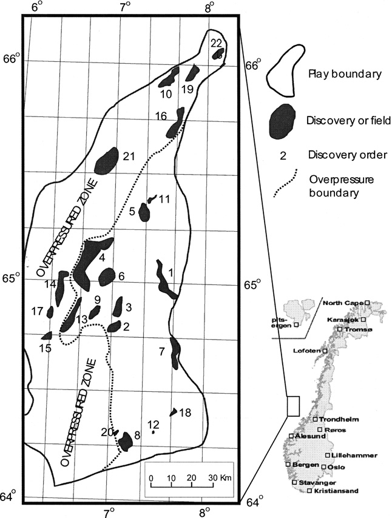

On the Importance of Promoting Bayesian Statistics
========================================================
author: Kenny Flagg
date: December 4, 2015


The Situation: Modeling the Oil Field Discovery Process
========================================================



***

Halten Terrace, Offshore Norway
* 22 fields discovered
* Questions of interest:
  + How many undiscovered fields are present?
  + What is the total volume of oil in the undiscovered fields?

The Discovery Process Model
========================================================

* Discovered field sizes: $Y_1,\dots,Y_n$
* Undiscovered field sizes: $S_{n+1},\dots,S_N$
* $N$ unknown
* The $Y_j$ and $S_k$ come from a $\mathrm{lognormal}(\mu,\sigma^2)$
population
* $(Y_1,\dots,Y_n)$ are a random sample from the population
* $Y_j$ sampled with probability proportional to $Y_j^\beta$
* $\mu$, $\sigma^2$, $\beta$ all unknown

The Discovery Process Model
========================================================

Likelihood:

$$p(\mathbf{Y}|N,\beta,\mu,\sigma^2,\mathbf{S})
=\begin{pmatrix}N \\ n\end{pmatrix}\prod_{i=1}^n\left(\frac{Y_i^\beta
\mathrm{logN}(Y_i|\mu,\sigma^2)}{\sum_{j=i}^nY_j+\sum_{k=n+1}^NS_k}\right)$$

* Sinding-Larsen and Chen (1996) fit by maximum likelihood
* Difficulties in finding estimates motivated the empirical Bayes
approach of Sinding-Larsen and Xu (2005)

Monte Carlo Method of Xu and Sinding-Larsen
========================================================

1. Draw $\left(N^{(i)},\beta^{(i)},\mu^{(i)},\sigma^{2(i)}\right)$
from the prior
2. Draw $\left(S_{n+1}^{(i)},\dots,S_N^{(i)}\right)$ independently
from $\mathrm{lognormal}\left(\mu^{(i)},\sigma^{2(i)}\right)$
3. Compute the likelihood weights $W_i=p\left(\mathbf{Y}|N^{(i)},
\beta^{(i)},\mu^{(i)},\sigma^{2(i)},\mathbf{S}^{(i)}\right)$

Posterior expectations and probabilities can be computed as weighted sums.

But I want POSTERIOR DRAWS!
========================================================

If the prior is used as a proposal distribution for rejection sampling,
the normalized likelihood is the acceptance probability.

I proposed 500,000 draws and 84 were accepted.

***


 

But I want POSTERIOR DRAWS!
========================================================

We have a discrete approximation of the posterior.

We can sample with replacement from the draws using the normalized
weights as probabilities.

But most of the distinct values are in the tails! We have little
information about the center of the distribution!

***

 

Why not use Gibbs sampling?
========================================================


```r
jags.model <- function(){
  m ~ dcat(p)
  N <- n + m
  mu ~ dnorm(2.38, 1.85)
  sigsq ~ dgamma(3.92, 1.36)
  tau <- pow(sigsq, -1)
  for(i in 1:n){
    y[i] ~ dlnorm(mu, tau)
  }
  for(i in 1:m){
    s[i] ~ dlnorm(mu, tau)
  }
}
```

Why not use Gibbs sampling?
========================================================


```
Error in jags.model(model.file, data = data, inits = init.values, n.chains = n.chains,  :
  RUNTIME ERROR:
Compilation error on line 11.
Unknown variable m
Either supply values for this variable with the data
or define it  on the left hand side of a relation.
```

Not (easily, at least) doable in canned software.

Bespoke Gibbs Sampler
========================================================

Complete conditionals:

$$p(\beta|N,\mu,\sigma^2,\mathbf{S},\mathbf{Y})
\propto p(\beta)\prod_{i=1}^n\left(\frac{Y_i^\beta}
{\sum_{j=i}^nY_j^\beta+\sum_{k=n+1}^NS_k^\beta}\right)$$

$$\begin{aligned}
p(N|\beta,\mu,\sigma^2,\mathbf{S},\mathbf{Y})
&\propto p(N)\prod_{k=n+1}^N\left(\frac{1}{\sqrt{2\pi\sigma^2}S_k}
e^{-\frac{1}{2\sigma^2}(\log S_k-\mu)^2}\right)\\
&\quad\times\begin{pmatrix}N \\ n\end{pmatrix}\prod_{i=1}^n
\left(\frac{1}{\sum_{j=i}^nY_j^\beta+\sum_{k=n+1}^NS_k^\beta}\right)
\end{aligned}$$

Bespoke Gibbs Sampler
========================================================

* Could use priors for $N$ and $\beta$ as proposal distributions
* Normal prior for $\mu$ and inverse-Gamma prior for $\sigma^2$
are conditionally conjugate
* Difficult to program, but doable

Other Issues
========================================================

* Empirical Bayes approach is complicated and unnecessary
* Posteriors summarized by histograms, means, and standard deviations
* Repeated use of ``Bayesian estimator''
* No discussion of a hierarchical version of the model

A Matter of Outreach
========================================================
* Scientists in the field look for easy answers to tough
statistical problems
* Recommending Bayesian methods as a last resort does not
present an accurate picture of Bayesian Statistics
* Bayesian philosophy and techniques should be included
in statistics curricula for the sciences
